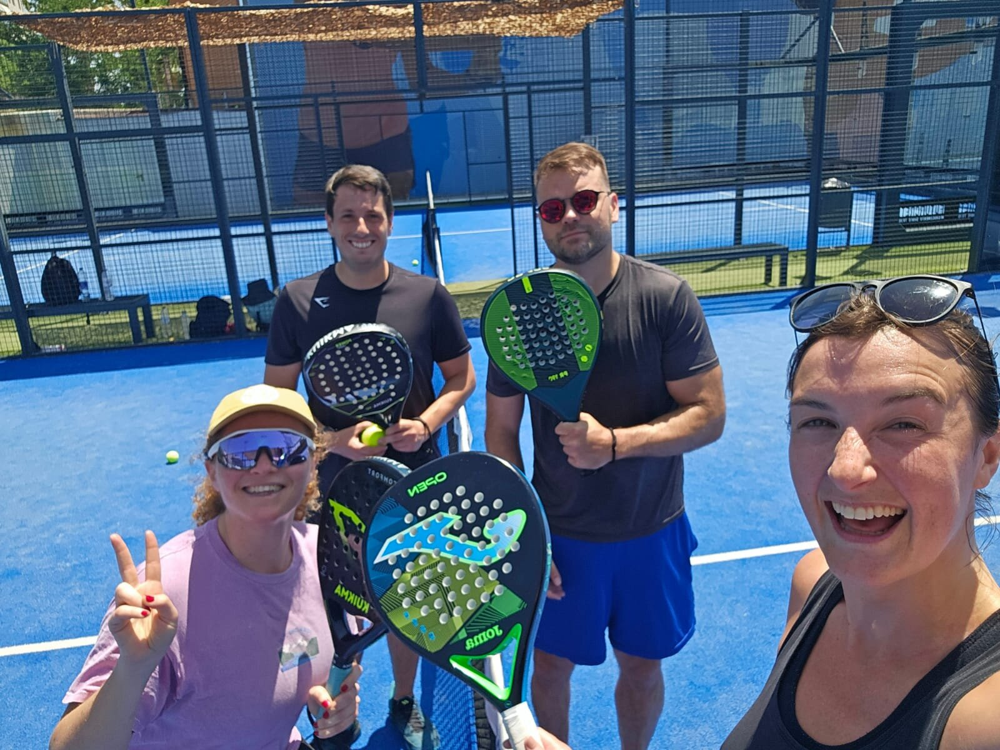

# Our Story: How Keep Calm Started

We get asked some version of this question a lot: is Keep Calm a real club, or just a group of friends who kept inviting people to a WhatsApp group? Here's the honest answer.

## Before Barcelona

Dan, Keep Calm's founder, had already run community sports and social groups before moving to Barcelona, so when he arrived, he knew he wanted to build something similar here.

His first attempt didn't quite work: a small multi-sport WhatsApp group for colleagues at the Barcelona Supercomputing Center. Uptake was slim. Sessions weren't subsidised by the employer, and without that, most people just didn't get involved.

Around the same time, Dan was playing padel with another expat group, but found it small and a bit cliquey, not the open, easy-to-join thing he was looking for. It was through that group that he met Harriet (also British), and together they started trying to get people together to reliably fill padel games at the weekend. Separately, through [Barcelona English Speakers](https://www.meetup.com/barcelona-english-speakers/), a Meetup group for expats in the city, Dan also met Uriel.

## The Group That Became Keep Calm

Keep Calm was officially founded on 25 May 2025, starting life as a single WhatsApp group built around those weekend padel games. Harriet was there from early on, doing a lot of the legwork recruiting new members and helping run both padel games and social events. Uriel joined in too, enjoying the padel games and occasionally running an Americana himself.

The group grew quickly, soon running regular weekly events, and it wasn't long before padel needed to split off into its own dedicated WhatsApp group, separate from the general community. Volleyball was added over the summer of 2025, and less than three months after padel split out, volleyball did too. Hiking, tennis and ping pong followed as more sports got added.

That pattern, a sport growing until it needs its own group, is basically how Keep Calm has scaled ever since. Every activity you see today (padel, volleyball, hiking, tennis, football, badminton, climbing, and more) started the same way: a handful of people wanting to play, organised in a WhatsApp group, growing until it needed a home of its own.

## What Makes Us Different

Barcelona has plenty of communities for English speakers, and we don't think Keep Calm needs to be all of them. We'd rather do a focused set of sports and social activities well than try to build a group for everything.

We also don't see other Barcelona communities as competition. There's more than enough room in this city for lots of different groups to thrive, and we'd rather build a positive ecosystem alongside them than compete for the same members. If someone finds their people somewhere else, that's a win too.

## Where We Are Today

Keep Calm is entirely volunteer-run and not-for-profit. There's no membership fee and no company behind it, just people who want to stay active, meet genuine people, and build friendships that actually last, in a city where most expat social life is transient by nature.

For a long time, most of the day-to-day driving force behind Keep Calm was Dan, working to make it easier for people to stay healthy, meet each other, and build real, long-term connections rather than one-off introductions. Through 2026, that's been changing by design: Dan has been growing the organiser base, with volunteers stepping up to help run individual sports and share the load. Keep Calm Core, our tier for the members who keep showing up and give back to the community, is a big part of how we think that keeps happening at scale, not something bolted on later.

## What's Next

Keep Calm isn't a registered legal entity yet, but we're working toward becoming a formal Association in the coming months, a step toward making the community something that can outlast any one person running it.

Becoming an Association won't change what Keep Calm is: still not-for-profit, never a company. We'll keep working with profit-making venues and clubs from time to time, courts, pitches and partners cost money to book, so that part is unavoidable. What it does mean is a proper legal structure behind the community itself, not turning Keep Calm into a business.

So, to answer the original question: yes, it's all voluntary. No, there isn't a club or company behind it, at least not yet. It started as a handful of friends trying to get a decent padel game together on a Saturday, and it grew from there because enough people wanted the same thing: a genuinely welcoming way to stay active and make real friends in Barcelona.
